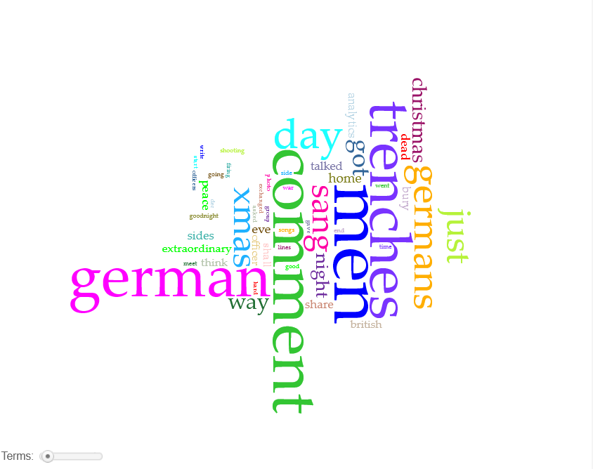



# Distant Reading Assignment 

I asked Voyant to analyze the text on this website, containing a [letter from a British Captain](https://news.lettersofnote.com/p/i-have-just-been-through-one-of-the) who witnessed a historic truce on Christmas of 1914.

In exploring Voyant, I learned that it often pulls from words that might not necessarily be relevant. For example, one of the top three most used words was "comment," which did not appear at all in the actual text. It did, however, appear fifteen times throughout the comments section of the website. This would likely be a significantly lessened issue on a text of a larger word count. In this document though, the appearance of words such as "comment" and "analytics" on the voyant visualization show one of its limitations.

--------------------------------------------------------------------------------------------
I also used copilot, and asked it to provide an analysis of the text. It went into a surprising degree of detail beyond what I would have expected. It came up with a textual analysis much like what I might have, even pulling direct quotes from the letter to support its conclusions. However, when asked how the British soldiers knew that the truce was not a German trick, a subject which is not explicitly addressed within the letter, it drew partially from fact to then extrapolate the mental state of the British soldiers to a degree which it seemingly has no source for. The record of that response is as follows:

The British officers did not completely assume it was not a trick. In fact, the letter shows that they remained cautious throughout the truce.

Several passages reveal why they gradually came to trust the Germans:

1. The Germans made peaceful gestures first

The Germans stopped firing, lit their trenches, shouted Christmas greetings, and called out "no shooting." These were visible signs that they were seeking a temporary peace rather than preparing an attack.

2. The behavior of the German soldiers was consistent

As the evening progressed, the Germans did not take advantage of the situation. Instead, they:

Sang songs.
Talked openly with British soldiers.
Asked permission to bury their dead.
Met British officers face-to-face.
Agreed on rules for the ceasefire.

This consistency made their intentions appear genuine.

3. Officers met each other directly

The writer and another officer personally crossed toward the German lines and spoke with the German officer in command. Military officers were accustomed to judging character and intentions. The formal introductions, salutes, and negotiated arrangements helped build confidence.

For example, the writer recalls:

"We saluted each other, he thanked me for permission to bury his dead..."

These are the actions of professional soldiers conducting a temporary agreement, not preparing an ambush.

4. They still took precautions

Most importantly, the British officers never fully dropped their guard. The writer explicitly says:

"Of course no precautions are relaxed."

And later:

"I think I shall be awake all night so as to be on the safe side."

This shows he trusted the Germans enough to participate in the truce, but not enough to abandon military vigilance.

5. Both sides had something to gain

The Germans wanted to recover and bury their dead, and the British wanted a peaceful Christmas. Since both sides benefited from cooperation, the officers could see a practical reason for the truce to hold.

Overall

The British officers did not simply believe the truce was genuine from the start. Rather, they tested trust gradually through conversation, observation, and negotiated agreements. Even while exchanging greetings and gifts, they maintained normal military precautions. The writer's attitude is best summed up by this line:

"I think they mean to play the game. All the same, I think I shall be awake all night so as to be on the safe side."

In other words, he believed the Germans were acting in good faith, but he never forgot that they were still the enemy.
-------------------------------------------------------------------------------------------------------------------------------------------
I think that the above works perfectly well as a textual analysis, but as a recounting of a first hand account of the event, it leaves room for inaccuracies that I would personally not abide if I were writing a research paper on the subject.

Works Cited:
Usher, Shaun. “I Have Just Been through One of the Most Extraordinary Scenes Imaginable.” Letters of Note, Letters of Note, 24 Dec. 2022, news.lettersofnote.com/p/i-have-just-been-through-one-of-the. 

“Voyant.” Voyant Tools, voyant.lincsproject.ca/?corpus=d0c3409cead40f3035fe58120974273e. Accessed 22 Sept. 2026.
